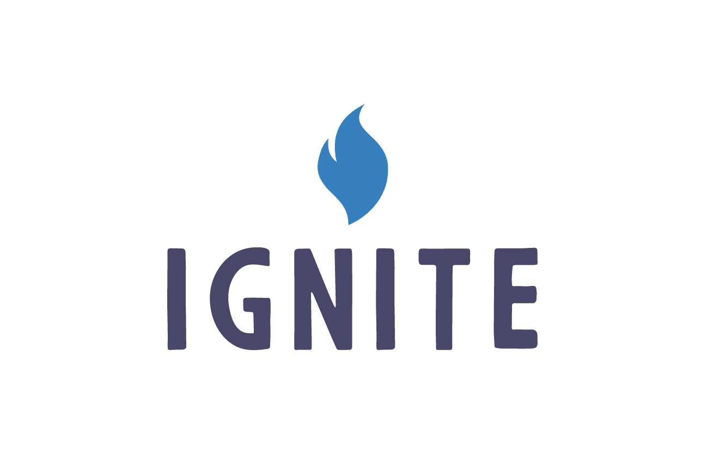

  

  

    Ignite Framework lets you build lean JavaScript library bundles which run in the <a href='https://backstage.forgerock.com/docs/idcloud/latest/home.html'>ForgeRock Identity Cloud</a> Decision Nodes!
     
    <a href="https://adam-cyclones.github.io/Ignite/#/"><strong>Explore the docs »</strong></a>
     
     
    <a href="https://github.com/adam-cyclones/Ignite/issues">Report Bug</a>
    –
    <a href="https://github.com/adam-cyclones/Ignite/issues">Request Feature</a>
  

# Ignite

Ignite Framework is for building lean JavaScript library bundles which run in the <a href='https://backstage.forgerock.com/docs/idcloud/latest/home.html'>ForgeRock Identity Cloud</a>, Ignite provides a whole mass of useful programming helpers and patches (known as fuel) to aid and improve the development experience of ForgeRock Identity Cloud decision nodes and Rhino.js, Ignite also ships a deployment CLI to help you target a script and deploy your bundle exactly where you need it, dependencies are inlined minified and optimized so you only get the libraries you need.

## Polyfills + Patches

Ignite prefers not to patch everything, leaving the pragmatic choices to you, but in some casses it adds a little sense into Rhino.js environments, introducing a `global` object for example, here is a list of non-optional built ins required for proper functionality.

- `console`
- fake `module` object
- Imrpoved ForgeRock Decision Node API layer
- `global` object

## Fuel libraries

These are just npm packages which get bundled, you could say that they ingite your scripts.

- client-script
- client-stylesheet
- console
- dom-utils
- logging
- platform-ui-component-api

### Worried about performance?

Dont panic! on-top of minifying your ignite bundle so it sits out of the way of your script, the build tool does not include any more than it needs to, your scripts also run in a Java backend which is much faster than node.js or your browser, its hard to compare apples to kiwis.

## Disclaimer

This repository is provided by the community of ForgeRock users. Ignite is not supported or tested by ForgeRock.
